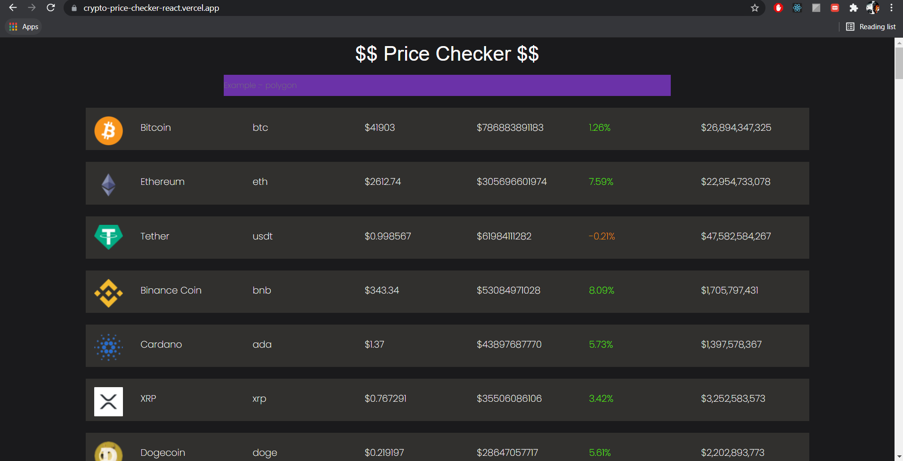
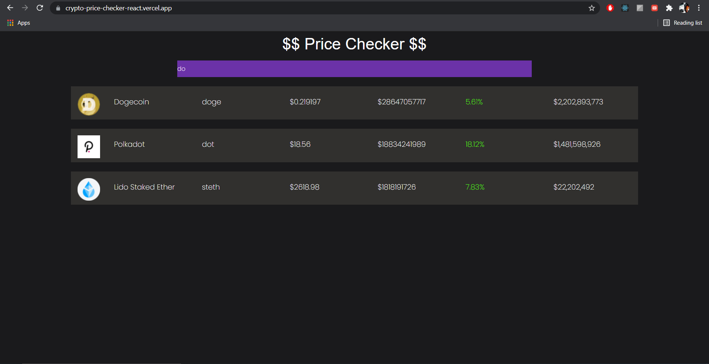

# CryptoPriceTracker-React  
## A react app which fetches current crypto prices from <a href="https://api.coingecko.com/api/v3/coins/markets?vs_currency=usd&order=market_cap_desc&per_page=100&page=1&sparkline=false">CoinGecko API</a> and having a dynamic search option. 
       
### UI screenshot  

   

### How to run -  
- Clone this repository
- Make sure you have latest version of `node` installed 
- Open terminal and write `npm install`     
- `npm start` (it will be live on port 3000) 

## Live at : - <a href="https://crypto-price-checker-react.vercel.app/">Link</a>    

